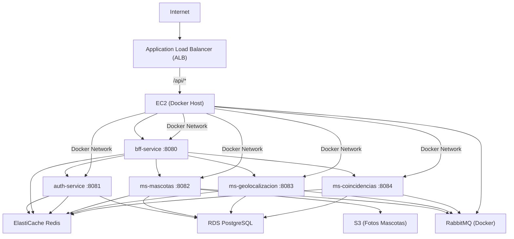

# Sanos y Salvos - Infraestructura AWS con Terraform

## ¿Qué contiene este repositorio?


Infraestructura como código (Terraform) para desplegar el sistema Sanos y Salvos en AWS Academy, incluyendo:

---

## Diagrama de despliegue



---

- **Red y Seguridad:**
  - VPC, subredes: `vpc.tf`
  - Grupos de seguridad: `security-groups.tf`
- **Base de datos:**
  - PostgreSQL (RDS): `rds.tf`, `init-db.sql`
- **Cache:**
  - Redis (ElastiCache): `elasticache.tf`
- **Almacenamiento:**
  - S3 para fotos: `s3.tf`
- **Contenedores y microservicios:**
  - ECR, logs ECS: `ecr.tf`, `ecs.tf`
  - Balanceador de carga: `alb.tf`
  - IAM: `iam.tf`
- **Variables y outputs:**
  - Variables: `variables.tf`
  - Outputs: `outputs.tf`
- **Scripts de despliegue:**
  - Backend: `deploy-backend.ps1`
  - Frontend: `deploy-frontend.ps1`
  - User data para EC2: `user-data.sh`
  - Inicialización de base de datos: `init-db.sql`

---

## Pasos para desplegar y probar todo (desde cero)

### 1. Actualiza credenciales
Edita `credentials.tf` con los datos de tu sesión actual de AWS Academy (AWS Details → AWS CLI).

### 2. Inicializa y aplica Terraform
Abre terminal en la carpeta del repo y ejecuta:
```sh
terraform init
terraform apply
```
Revisa los outputs al finalizar.


### 3. Crea y configura el bucket S3 para fotos de mascotas

> ⚠️ **IMPORTANTE — Nombre del bucket:**
> S3 usa un **namespace global** compartido por todas las cuentas de AWS en el mundo.
> El nombre `sanos-y-salvos-mascotas-fotos` ya puede estar tomado por otra cuenta.
> **Siempre usa tu Account ID como sufijo** para garantizar unicidad:
> ```
> sanos-y-salvos-mascotas-<TU_ACCOUNT_ID>
> ```
> Ejemplo: `sanos-y-salvos-mascotas-895112511964`

**a) Obtener tu Account ID y crear el bucket:**
```sh
ACCOUNT_ID=$(aws sts get-caller-identity --query Account --output text)
BUCKET="sanos-y-salvos-mascotas-${ACCOUNT_ID}"

aws s3 mb s3://$BUCKET --region us-east-1
echo "Bucket creado: $BUCKET"
```

**b) Desactivar bloqueo de acceso público y aplicar política:**
```sh
aws s3api delete-public-access-block --bucket $BUCKET

aws s3api put-bucket-policy --bucket $BUCKET --policy "{
  \"Version\": \"2012-10-17\",
  \"Statement\": [{
    \"Sid\": \"PublicRead\",
    \"Effect\": \"Allow\",
    \"Principal\": \"*\",
    \"Action\": \"s3:GetObject\",
    \"Resource\": \"arn:aws:s3:::${BUCKET}/*\"
  }]
}"
```

**c) Configurar el microservicio ms-mascotas con el nombre correcto:**

Al lanzar el contenedor de `ms-mascotas`, pasa la variable de entorno:
```sh
-e MINIO_BUCKET=$BUCKET
```

Si ya está corriendo, reinícialo con el nombre del bucket correcto (ver guía de despliegue).

### 4. Despliega el backend
Asegúrate de tener Docker Desktop y AWS CLI instalados. Ejecuta:
```powershell
.\deploy-backend.ps1
```
Esto construye imágenes, sube a ECR, lanza EC2 y ejecuta los microservicios.

### 5. Inicializa las bases de datos
Cuando los contenedores estén corriendo, ejecuta el script SQL en RDS:
```sh
psql -h <RDS_HOST> -U sanosadmin -d postgres -f init-db.sql
```
Esto crea las 4 bases de datos y extensiones necesarias.

### 6. Despliega el frontend
Ejecuta:
```powershell
.\deploy-frontend.ps1
```
Esto sube el build del frontend al bucket S3 configurado como sitio web.

### 7. Verifica la aplicación
Abre la URL pública del ALB (output de Terraform) en tu navegador. El frontend debe estar disponible y los microservicios funcionando.

---

## Notas importantes
- Si cambian las credenciales de AWS Academy, actualiza `credentials.tf` y repite los pasos de despliegue.
- El bucket S3 debe crearse y configurarse manualmente cada vez que se borre.
- Los scripts PowerShell requieren permisos de ejecución.
- El script `user-data.sh` se ejecuta automáticamente al lanzar la instancia EC2.

---

¿Dudas? Revisa los comentarios en cada archivo `.tf` y los scripts para más detalles.