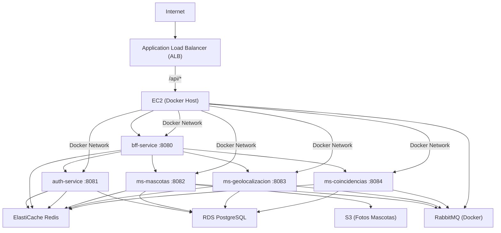

# Sanos y Salvos - Infraestructura AWS con Terraform

## ¿Qué contiene este repositorio?


Infraestructura como código (Terraform) para desplegar el sistema Sanos y Salvos en AWS Academy, incluyendo:

---

## Diagrama de despliegue



---

- **Red y Seguridad:**
  - VPC, subredes: `vpc.tf`
  - Grupos de seguridad: `security-groups.tf`
- **Base de datos:**
  - PostgreSQL (RDS): `rds.tf`, `init-db.sql`
- **Cache:**
  - Redis (ElastiCache): `elasticache.tf`
- **Almacenamiento:**
  - S3 para fotos: `s3.tf`
- **Contenedores y microservicios:**
  - ECR, logs ECS: `ecr.tf`, `ecs.tf`
  - Balanceador de carga: `alb.tf`
  - IAM: `iam.tf`
- **Variables y outputs:**
  - Variables: `variables.tf`
  - Outputs: `outputs.tf`
- **Scripts de despliegue:**
  - Backend: `deploy-backend.ps1`
  - Frontend: `deploy-frontend.ps1`
  - User data para EC2: `user-data.sh`
  - Inicialización de base de datos: `init-db.sql`

---

## Pasos para desplegar y probar todo (desde cero)

### 1. Actualiza credenciales
Edita `credentials.tf` con los datos de tu sesión actual de AWS Academy (AWS Details → AWS CLI).

### 2. Inicializa y aplica Terraform
Abre terminal en la carpeta del repo y ejecuta:
```sh
terraform init
terraform apply
```
Revisa los outputs al finalizar.


### 3. Crea y configura el bucket S3 manualmente
AWS Academy no permite crear el bucket por Terraform. Debes hacerlo con AWS CLI:

**a) Crear el bucket:**
```sh
aws s3 mb s3://sanos-y-salvos-mascotas-fotos --region us-east-1
```

**b) Habilitar el bucket como sitio web:**
```sh
aws s3 website s3://sanos-y-salvos-mascotas-fotos/ --index-document index.html
```

**c) Permitir acceso público (opcional, para pruebas):**
```sh
aws s3api put-bucket-policy --bucket sanos-y-salvos-mascotas-fotos --policy file://bucket-policy.json
```
Deben crear un archivo `bucket-policy.json` con una política similar a:
```json
{
  "Version": "2012-10-17",
  "Statement": [
    {
      "Sid": "PublicReadGetObject",
      "Effect": "Allow",
      "Principal": "*",
      "Action": "s3:GetObject",
      "Resource": "arn:aws:s3:::sanos-y-salvos-mascotas-fotos/*"
    }
  ]
}
```

**d) Subir archivos de prueba (opcional):**
```sh
aws s3 cp archivo.jpg s3://sanos-y-salvos-mascotas-fotos/
```

**e) Verifica la URL del sitio web:**
La URL será:
```
http://sanos-y-salvos-mascotas-fotos.s3-website-us-east-1.amazonaws.com
```

Configura los permisos según la necesidad de tu aplicación y las políticas de tu curso.

### 4. Despliega el backend
Asegúrate de tener Docker Desktop y AWS CLI instalados. Ejecuta:
```powershell
.\deploy-backend.ps1
```
Esto construye imágenes, sube a ECR, lanza EC2 y ejecuta los microservicios.

### 5. Inicializa las bases de datos
Cuando los contenedores estén corriendo, ejecuta el script SQL en RDS:
```sh
psql -h <RDS_HOST> -U sanosadmin -d postgres -f init-db.sql
```
Esto crea las 4 bases de datos y extensiones necesarias.

### 6. Despliega el frontend
Ejecuta:
```powershell
.\deploy-frontend.ps1
```
Esto sube el build del frontend al bucket S3 configurado como sitio web.

### 7. Verifica la aplicación
Abre la URL pública del ALB (output de Terraform) en tu navegador. El frontend debe estar disponible y los microservicios funcionando.

---

## Notas importantes
- Si cambian las credenciales de AWS Academy, actualiza `credentials.tf` y repite los pasos de despliegue.
- El bucket S3 debe crearse y configurarse manualmente cada vez que se borre.
- Los scripts PowerShell requieren permisos de ejecución.
- El script `user-data.sh` se ejecuta automáticamente al lanzar la instancia EC2.

---

¿Dudas? Revisa los comentarios en cada archivo `.tf` y los scripts para más detalles.