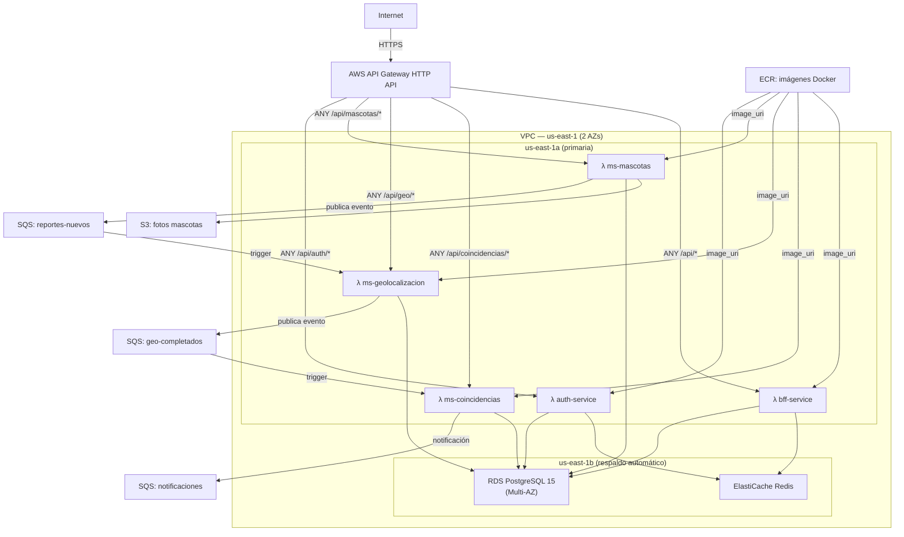

# Sanos y Salvos — Infraestructura AWS con Terraform

> Arquitectura serverless: **API Gateway → Lambda × 5 → RDS · Redis · SQS · S3**  
> Desplegable en AWS Academy sin permisos de creación de roles IAM.

---

## Diagrama de despliegue



---

## Archivos Terraform

| Archivo | Descripción |
|---|---|
| `provider.tf` | AWS provider, región us-east-1 |
| `variables.tf` | Variables (proyecto, DB, región, etc.) |
| `credentials.tf` | ⚠️ **NO en GitHub** — credenciales temporales Academy |
| `vpc.tf` | VPC, subnets privadas/públicas (2 AZs), IGW, NAT |
| `security-groups.tf` | SGs para Lambda, RDS, Redis, ALB |
| `rds.tf` | RDS PostgreSQL 15 (Multi-AZ standby) |
| `elasticache.tf` | ElastiCache Redis 7 |
| `ecr.tf` | Repositorios ECR (uno por microservicio) |
| `s3.tf` | Bucket S3 para fotos de mascotas y frontend |
| `sqs.tf` | Colas SQS (reportes-nuevos, geo-completados, notificaciones + DLQs) |
| `lambda.tf` | 5 funciones Lambda + SQS event source mappings |
| `api-gateway.tf` | HTTP API Gateway + rutas + permisos |
| `outputs.tf` | URLs, ARNs y datos de conexión útiles |
| `init-databases.sql` | Schema completo para las 4 bases de datos |

---

## Pasos para desplegar desde cero

### 1. Actualiza credenciales

Edita `credentials.tf` con los datos de tu sesión actual de AWS Academy (**AWS Details → AWS CLI**):

```hcl
provider "aws" {
  region     = "us-east-1"
  access_key = "ASIA..."
  secret_key = "..."
  token      = "..."
}
```

O usa el script automático:
```powershell
.\update-credentials.ps1
```

### 2. Limpia el estado anterior (nueva sesión Academy)

```powershell
if (Test-Path "terraform.tfstate") {
    Rename-Item "terraform.tfstate" "terraform.tfstate.old"
}
```

### 3. Inicializa y aplica Terraform

```sh
terraform init -upgrade
terraform apply -auto-approve
```

Tarda **10–15 minutos**. Crea: VPC · subnets · SGs · RDS · Redis · ECR · SQS · Lambdas · API Gateway.

Al terminar, guarda los outputs:
```sh
terraform output
```

El dato más importante es `api_gateway_url` — es el punto de entrada de la aplicación.

### 4. Construye y publica las imágenes Docker en ECR

```powershell
# Login a ECR (usa el comando del output 'ecr_login_command')
aws ecr get-login-password --region us-east-1 | docker login --username AWS --password-stdin <ACCOUNT_ID>.dkr.ecr.us-east-1.amazonaws.com

# Build y push de cada microservicio
cd ..\Sanos-y-Salvos

# Ejemplo para ms-mascotas (repetir para los otros 4)
docker build -t ms-mascotas ./ms-mascotas
docker tag ms-mascotas:latest <ECR_URL>/ms-mascotas:latest
docker push <ECR_URL>/ms-mascotas:latest
```

Las URLs ECR las encuentras en `terraform output docker_push_commands`.

### 5. Recarga las funciones Lambda con la nueva imagen

```sh
aws lambda update-function-code --function-name sanos-auth-service        --image-uri <ECR_URL>/auth-service:latest
aws lambda update-function-code --function-name sanos-bff-service         --image-uri <ECR_URL>/bff-service:latest
aws lambda update-function-code --function-name sanos-ms-mascotas         --image-uri <ECR_URL>/ms-mascotas:latest
aws lambda update-function-code --function-name sanos-ms-geolocalizacion  --image-uri <ECR_URL>/ms-geolocalizacion:latest
aws lambda update-function-code --function-name sanos-ms-coincidencias    --image-uri <ECR_URL>/ms-coincidencias:latest
```

### 6. Inicializa las bases de datos en RDS

```sh
psql -h <RDS_HOST> -U sanosadmin -d postgres -f init-databases.sql
```

El `RDS_HOST` lo encuentras en `terraform output rds_host`.

### 7. Despliega el frontend en S3

```powershell
.\deploy-frontend.ps1
```

O manualmente:
```sh
cd ..\Sanos-y-Salvos\frontend
npm install && npm run build
aws s3 sync dist/ s3://sanos-y-salvos-mascotas-fotos/ --delete
```

### 8. Verifica la aplicación

```sh
# La URL del API Gateway (sin trailing slash)
API=$(terraform output -raw api_gateway_url)

# Catálogo de especies (sin JWT)
curl $API/api/mascotas/especies

# Login
curl -X POST $API/api/auth/login \
  -H "Content-Type: application/json" \
  -d '{"email":"test@test.com","password":"Test1234!"}'
```

---

## Notas importantes

- **Sin EC2 ni RabbitMQ** — La arquitectura es 100% serverless. No hay instancias que mantener.
- **Lambda Web Adapter** — Cada microservicio Spring Boot corre dentro de Lambda sin cambios de código. El adaptador (`public.ecr.aws/awsguru/aws-lambda-adapter:0.8.4`) traduce los eventos HTTP de API Gateway en peticiones HTTP estándar.
- **SQS reemplaza RabbitMQ** — Flujo async: `ms-mascotas` publica en `reportes-nuevos` → Lambda trigger en `ms-geolocalizacion` → publica en `geo-completados` → Lambda trigger en `ms-coincidencias`.
- **Alta disponibilidad** — Lambdas en VPC con subnets en 2 AZs. Si `us-east-1a` falla, AWS redirige invocaciones a `us-east-1b` automáticamente.
- **AWS Academy compatible** — Todas las Lambdas usan `LabRole` (existente). No se crea ningún rol IAM nuevo.
- **Credenciales expiran** — Las credenciales Academy duran ~4 horas. Si aparece `ExpiredTokenException`, actualiza `credentials.tf` y ejecuta `terraform apply` nuevamente.

---

## Estructura del modelo de datos (mascotas_db)

```
especies (id, nombre)          → PERRO, GATO, AVE, CONEJO, OTRO
  └─> razas (id, especie_id, nombre)    → Labrador, Siamés, etc.
        └─> reportes (id, tipo, especie_id, raza_id, ...)
              ├── tipo = "PERDIDO"   → campos recompensa
              └── tipo = "ENCONTRADO" → campos lugar_resguardo, tiene_collar
```

---

¿Dudas? Revisa `DEPLOY_GUIDE.md` para la guía paso a paso completa con solución de problemas.
